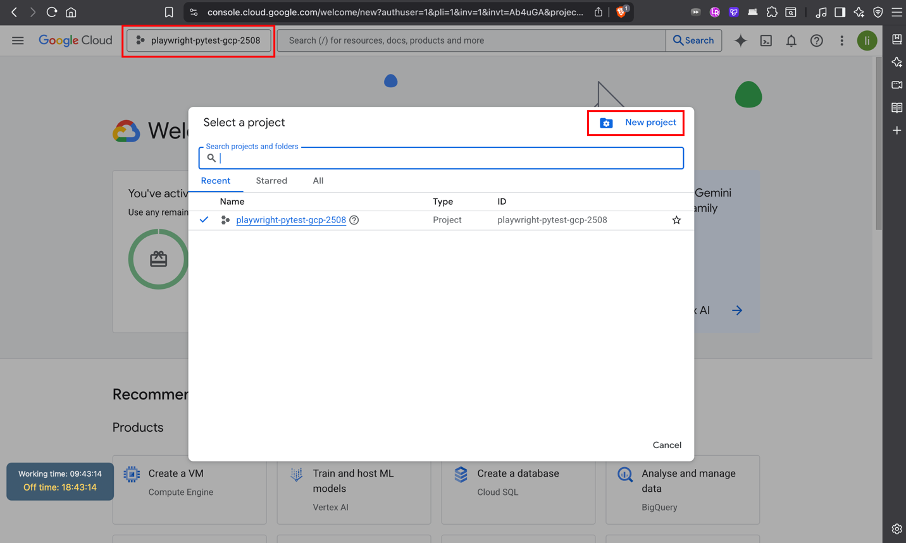
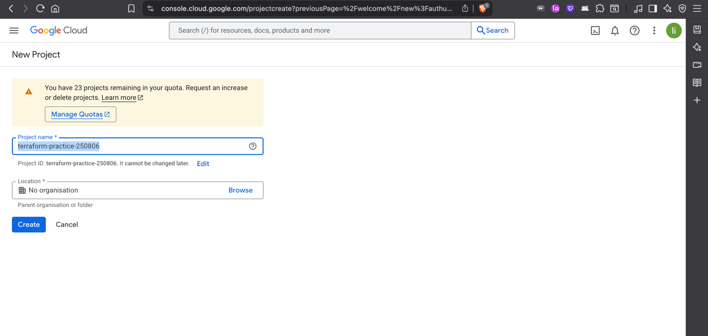
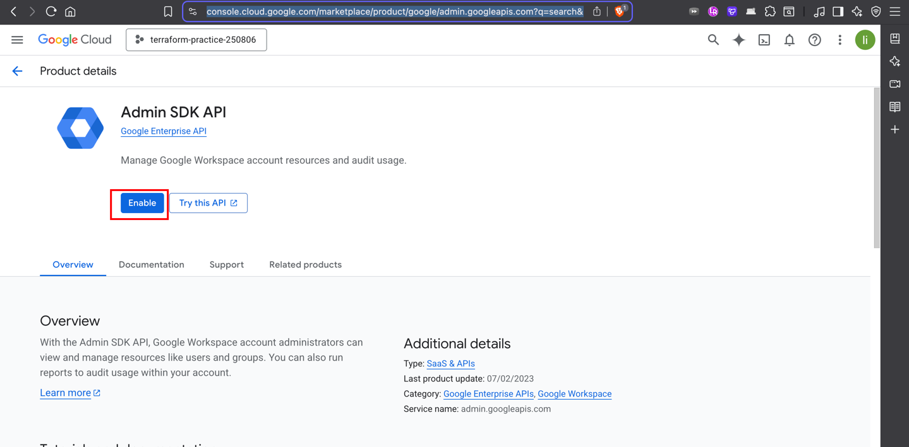
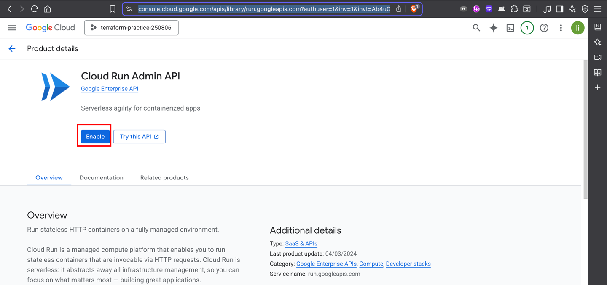
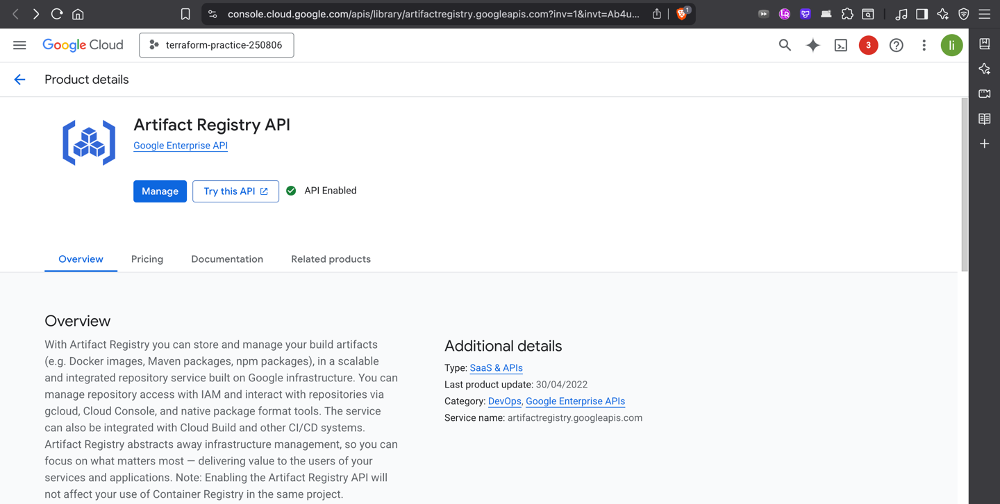
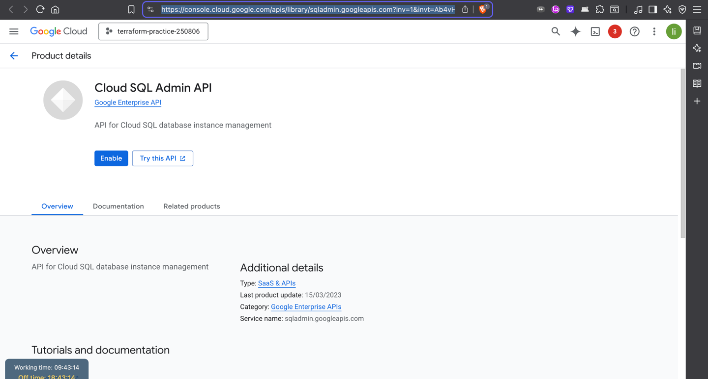
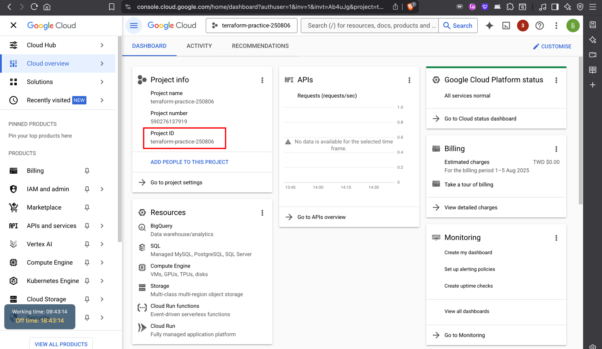
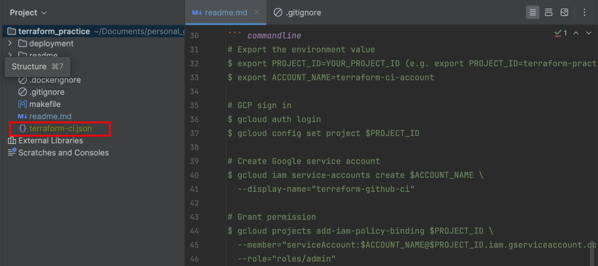

## Google Cloud - Create new project
https://console.cloud.google.com/welcome/new?authuser=1&pli=1&inv=1&invt=Ab4uGA




## Google Cloud - Enable the permission 
go to api library 
https://console.cloud.google.com/apis/library?authuser=1&inv=1&invt=Ab4uGA&project=terraform-practice-250806

admin sdk api
https://console.cloud.google.com/marketplace/product/google/admin.googleapis.com?q=search&referrer=search&authuser=1&inv=1&invt=Ab4uGA&project=terraform-practice-250806


cloud run admin api
https://console.cloud.google.com/apis/library/run.googleapis.com?authuser=1&inv=1&invt=Ab4uGA&project=terraform-practice-250806


artifact registry api
https://console.cloud.google.com/apis/library/artifactregistry.googleapis.com?inv=1&invt=Ab4uJg&authuser=1&project=terraform-practice-250806


cloud sql admin api
https://console.cloud.google.com/apis/library/sqladmin.googleapis.com?inv=1&invt=Ab4vHw&authuser=1&project=terraform-practice-250806


## Local Terminal - Install GCP sdk
``` commandline
$ brew install --cask google-cloud-sdk
```

## Local Terminal - Setup GCP account token
command line
``` commandline
# Export the environment value
$ export PROJECT_ID=YOUR_PROJECT_ID (e.g. export PROJECT_ID=terraform-practice-250806
$ export ACCOUNT_NAME=terraform-ci-account

# GCP sign in
$ gcloud auth login
$ gcloud config set project $PROJECT_ID

# Create Google service account
$ gcloud iam service-accounts create $ACCOUNT_NAME \
  --display-name="terreform-github-ci"

# Grant permission
$ gcloud projects add-iam-policy-binding $PROJECT_ID \
  --member="serviceAccount:$ACCOUNT_NAME@$PROJECT_ID.iam.gserviceaccount.com" \
  --role="roles/admin"

# CloudSql grant permission
gcloud projects add-iam-policy-binding terraform-practice-250806 \
  --member="serviceAccount:terraform-ci-account@terraform-practice-250806.iam.gserviceaccount.com" \
  --role="roles/cloudsql.admin"
 
# Genarate token
$ gcloud iam service-accounts keys create terraform-ci.json \
  --iam-account=$ACCOUNT_NAME@$PROJECT_ID.iam.gserviceaccount.com
```
How to get PROJECT_ID
https://console.cloud.google.com/home/dashboard?authuser=1&inv=1&invt=Ab4uJg&project=terraform-practice-250806


After execute all command line will get `terraform-ci.json`


## Github - Setup Repository secrets
Repo → Settings → Secret and variables → Action → Repository secrets → New repository secret
- Name = GCP_CREDENTIALS
- Secret = {terraform-ci.json}


## Google Cloud - Create service

