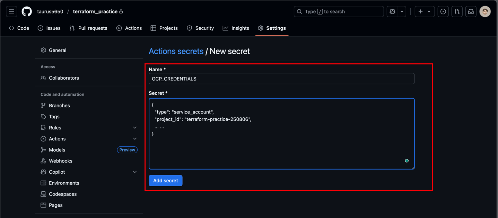

# Terraform & Google Cloud practice step by step

Here's the practice of Terraform (IaC) & Google Cloud with Python Flask.

## Operation

### Google Cloud - Create new project

https://console.cloud.google.com/welcome/new?authuser=1&pli=1&inv=1&invt=Ab4uGA


### Local Terminal - Enable Google API
Prepare `deployment/terraform/enable.tf` <br>
Execute command
``` commandline
$ make run-terraform-first-time-enable-tf
```


Check the service <br>
https://console.cloud.google.com/apis/library?authuser=2&hl=en-GB&inv=1&invt=Ab4w3g&project=terraform-practice-250806


  
### Local Terminal - Install GCP sdk

``` commandline
$ brew install --cask google-cloud-sdk
```

### Local Terminal - Setup GCP account token

``` commandline
# Export the environment value
$ export PROJECT_ID=YOUR_PROJECT_ID (e.g. export PROJECT_ID=terraform-practice-250806
$ export ACCOUNT_NAME=terraform-ci-account

# GCP sign in
$ gcloud auth login
$ gcloud config set project $PROJECT_ID

# Create Google service account
$ gcloud iam service-accounts create $ACCOUNT_NAME \
  --display-name="terreform-github-ci"

# Grant permission
$ gcloud projects add-iam-policy-binding $PROJECT_ID \
  --member="serviceAccount:$ACCOUNT_NAME@$PROJECT_ID.iam.gserviceaccount.com" \
  --role="roles/admin"

# CloudSql grant permission
gcloud projects add-iam-policy-binding terraform-practice-250806 \
  --member="serviceAccount:terraform-ci-account@terraform-practice-250806.iam.gserviceaccount.com" \
  --role="roles/cloudsql.admin"
 
# Genarate token
$ gcloud iam service-accounts keys create terraform-ci.json \
  --iam-account=$ACCOUNT_NAME@$PROJECT_ID.iam.gserviceaccount.com
```

How to get PROJECT_ID <br>
https://console.cloud.google.com/home/dashboard?authuser=1&inv=1&invt=Ab4uJg&project=terraform-practice-250806


After execute all command line will get `terraform-ci.json`


Double check IAM role <br>
https://console.cloud.google.com/iam-admin/iam?authuser=2&inv=1&invt=Ab4whg&project=terraform-practice-250806


### Github - Setup Repository secrets
Repo → Settings → Secret and variables → Action → Repository secrets → New repository secret
- Name = GCP_CREDENTIALS
- Secret = {terraform-ci.json}



### Repo - Setup github action & terraform & makefile
Follow the repo's documentation

